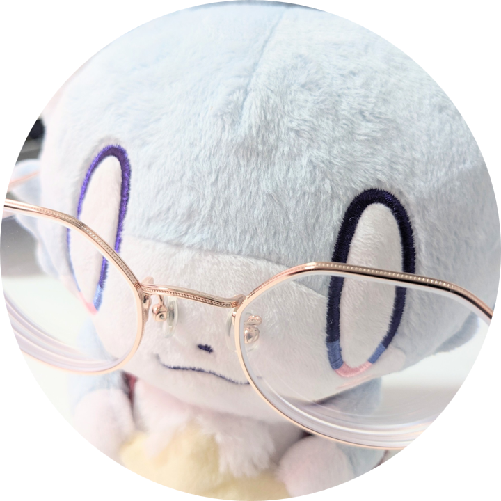
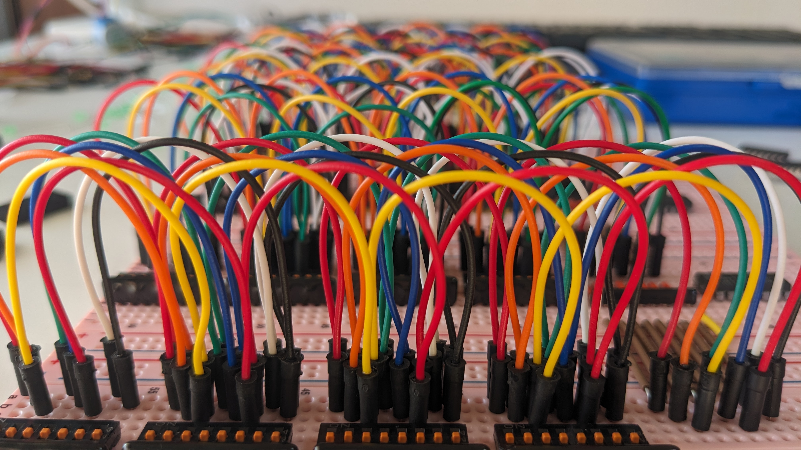
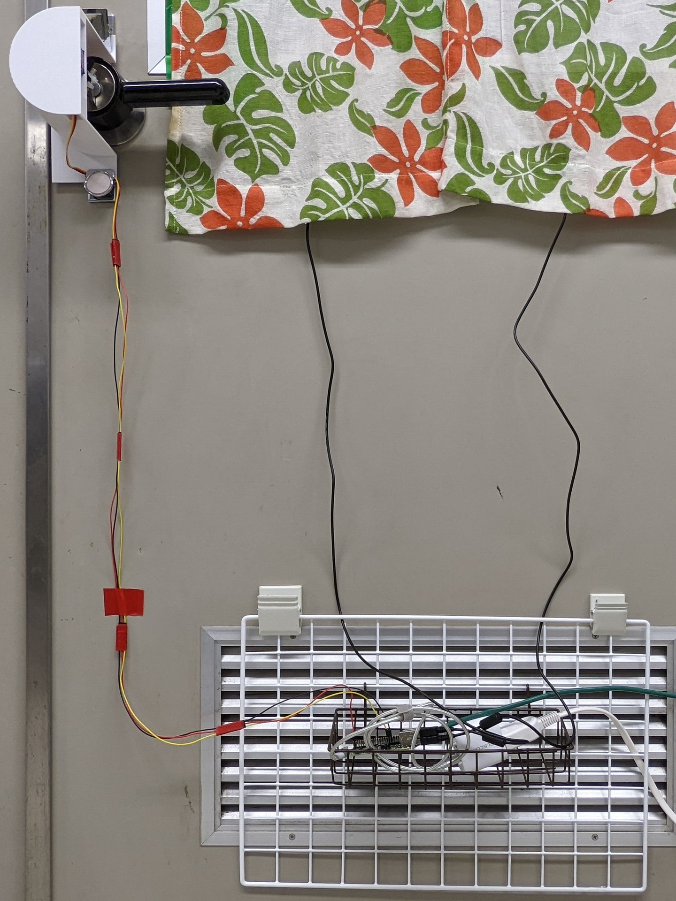

  <h3>\ Hi  /</h3>
  
     

**さりえり** です。よろしくお願いします。

## 🔗 リンク 🔗

[![Twitter][icon-twitter]](https://x.com/k4u_jp)
[![GitHub][icon-github]](https://github.com/salieri256)
[![Homepage][icon-house]](https://k4u.jp)

[icon-twitter]: ./icons/twitter.svg
[icon-github]: ./icons/github.svg
[icon-house]: ./icons/house.svg

## 🌱 興味・関心 🌱

[![Skill][icon-skills]](https://skillicons.dev)

[icon-skills]: https://skillicons.dev/icons?i=linux,docker,openstack,terraform,ansible,cloudflare,html,css,javascript,python&theme=light&perline=10

## ✍️ その他 ✍️

### 2025

||
|:-:|
|『CPUの創りかた』を読んでCPUを作った (画像はメモリ部)|

### 2022

||
|:-:|
|研究室用にスマートロックを作った 🔗 [salieri256/opensesame-front: 入退室管理システム](https://github.com/salieri256/opensesame-front) 🔗 [salieri256/opensesame-back: 入退室管理システム](https://github.com/salieri256/opensesame-back)|

